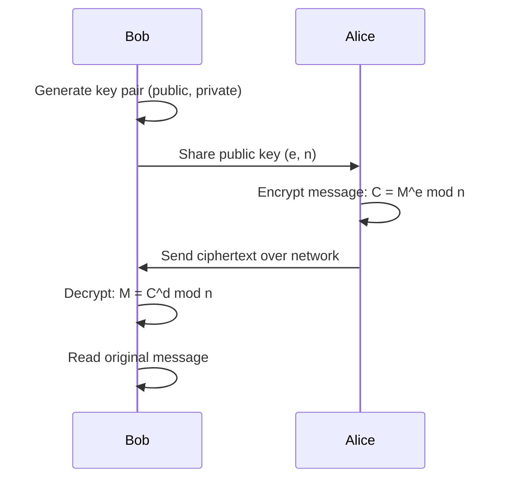

# RSA Asymmetric Key Cryptography — Assignment Report

## Secure Communication Between Alice & Bob

**Course:** Cyber Security Fundamentals  
**Topic:** Public Key Cryptography (RSA Algorithm)  
**Date:** May 2026

---

## 1. Introduction & Theory

### What is RSA?
RSA (Rivest–Shamir–Adleman) is an **asymmetric encryption algorithm** that uses two mathematically linked keys — a **public key** for encryption and a **private key** for decryption. Unlike symmetric cryptography (where both parties share one secret key), RSA allows secure communication without ever sharing a secret key over the network.

### Why Asymmetric Cryptography?
In symmetric systems, the shared secret key must be transmitted securely — a chicken-and-egg problem. RSA solves this by allowing Bob to publish his public key openly. Anyone (including Alice) can encrypt a message with it, but **only Bob** can decrypt it with his private key.

### Mathematical Foundation
RSA's security rests on the **difficulty of factoring large composite numbers**. Given `n = p × q` (where p and q are large primes), it is computationally infeasible to recover p and q from n alone.

---

## 2. Algorithm — Step by Step

### Key Generation (Bob)

```
Step 1:  Select two distinct large prime numbers p and q
Step 2:  Compute  n = p × q                (the modulus)
Step 3:  Compute  φ(n) = (p−1) × (q−1)    (Euler's totient)
Step 4:  Choose   e such that 1 < e < φ(n) and gcd(e, φ(n)) = 1
Step 5:  Compute  d such that (d × e) ≡ 1 (mod φ(n))
         → d is the modular inverse of e modulo φ(n)

Public Key  = (e, n)   → shared with Alice
Private Key = (d, n)   → kept secret by Bob
```

### Encryption (Alice)

```
For each character M in the plaintext:
    C = M^e mod n

where (e, n) is Bob's public key.
```

### Decryption (Bob)

```
For each ciphertext block C:
    M = C^d mod n

where (d, n) is Bob's private key.
```

---

## 3. Communication Flow



| Step | Actor | Action | Data |
|------|-------|--------|------|
| 1 | Bob | Generates RSA key pair | Public key (e, n), Private key (d, n) |
| 2 | Bob → Alice | Shares public key | (e, n) sent openly |
| 3 | Alice | Encrypts plaintext | C = M^e mod n |
| 4 | Alice → Bob | Transmits ciphertext | Encrypted integers |
| 5 | Bob | Decrypts ciphertext | M = C^d mod n |
| 6 | Bob | Verifies message | Original plaintext recovered |

---

## 4. Implementation Details

### Source File
[rsa_crypto.py](file:///c:/projects/cryptography/rsa_crypto.py)

### Program Structure

| Section | Function | Purpose |
|---------|----------|---------|
| Prime Utils | `is_prime()` | Tests primality of a number |
| Prime Utils | `generate_prime_in_range()` | Generates random prime in range |
| Math | `gcd()` | Euclidean algorithm for GCD |
| Math | `mod_inverse()` | Extended Euclidean for modular inverse |
| Math | `mod_exp()` | Square-and-multiply modular exponentiation |
| Key Gen | `generate_keys()` | Full RSA key pair generation |
| Conversion | `text_to_numbers()` | Plaintext → ASCII integer list |
| Conversion | `numbers_to_text()` | Integer list → plaintext |
| Encryption | `encrypt()` | RSA encryption using public key |
| Decryption | `decrypt()` | RSA decryption using private key |
| Verify | `verify_result()` | Confirms decrypted == original |
| Test | `run_test_case()` | End-to-end test runner |

### Key Algorithms

**Modular Exponentiation (Square-and-Multiply):**
Instead of computing `M^e` directly (which would produce astronomically large numbers), we use binary exponentiation — processing the exponent bit by bit, squaring and multiplying modulo n at each step. This keeps intermediate values small and runs in O(log e) time.

**Extended Euclidean Algorithm:**
Used to compute the private key `d` as the modular inverse of `e` modulo `φ(n)`. It extends the standard Euclidean GCD algorithm to also find coefficients x, y such that `ax + by = gcd(a, b)`.

### Error Handling
- Validates that user-supplied p and q are actually prime
- Ensures p ≠ q
- Checks that n = p×q ≥ 128 (minimum for ASCII characters)
- Validates each character's ASCII value < n before encryption
- Asserts the key relationship `(e × d) mod φ(n) = 1` after generation

---

## 5. Sample Outputs

### Test Case 1: "Hello Bob!" (p=61, q=53)

```
Prime p         = 61
Prime q         = 53
Modulus n = p*q = 3233
Euler's phi(n)  = 3120
Public Key  (e, n) = (17, 3233)
Private Key (d, n) = (2753, 3233)

[ALICE] Original Message : "Hello Bob!"
[ALICE] Numerical Format : [72, 101, 108, 108, 111, 32, 66, 111, 98, 33]
[ALICE] Encrypted (sent) : [3000, 1313, 745, 745, 2185, 1992, 524, 2185, 2570, 1853]

[BOB]   Decrypted Message : "Hello Bob!"
VERIFICATION PASSED: Decrypted output matches original.
```

### Test Case 2: "RSA 2026" (p=101, q=103)

```
Modulus n = p*q = 10403
Public Key  (e, n) = (7, 10403)
Private Key (d, n) = (8743, 10403)

[ALICE] Original Message : "RSA 2026"
[ALICE] Encrypted (sent) : [6642, 10355, 623, 2564, 2813, 4472, 2813, 138]

[BOB]   Decrypted Message : "RSA 2026"
VERIFICATION PASSED
```

### Test Case 3: "Cyber Security is important!" (p=239, q=251)

```
Modulus n = p*q = 59989
Public Key  (e, n) = (3, 59989)
Private Key (d, n) = (39667, 59989)

[ALICE] Original Message : "Cyber Security is important!"
[ALICE] Encrypted (sent) : [818, 31880, 41357, 10488, 41808, ...]

[BOB]   Decrypted Message : "Cyber Security is important!"
VERIFICATION PASSED
```

### Test Case 4: Special Characters "Key: A1@#$" (p=307, q=311)

```
Modulus n = p*q = 95477
Public Key  (e, n) = (65537, 95477)

[ALICE] Original Message : "Key: A1@#$"
[BOB]   Decrypted Message : "Key: A1@#$"
VERIFICATION PASSED
```

### Test Case 5: Auto-Generated Primes

```
[BOB] primes auto-selected from range [100, 999]
[ALICE] Original Message : "Auto prime test!"
[BOB]   Decrypted Message : "Auto prime test!"
VERIFICATION PASSED
```

> [!IMPORTANT]
> All 5 test cases passed — the decrypted output matches the original input in every case, confirming the correctness of the RSA implementation.

---

## 6. Results & Analysis

| Test | Message | Primes (p, q) | n | Key Size | Result |
|------|---------|---------------|---|----------|--------|
| 1 | Hello Bob! | 61, 53 | 3,233 | 12-bit | ✓ Pass |
| 2 | RSA 2026 | 101, 103 | 10,403 | 14-bit | ✓ Pass |
| 3 | Cyber Security is important! | 239, 251 | 59,989 | 16-bit | ✓ Pass |
| 4 | Key: A1@#$ | 307, 311 | 95,477 | 17-bit | ✓ Pass |
| 5 | Auto prime test! | Auto | Auto | Varies | ✓ Pass |

### Key Observations

1. **Correctness**: Every decrypted message exactly matches the original plaintext, proving the mathematical relationship `M = (M^e)^d mod n` holds.
2. **Character Encoding**: Each character is independently encrypted using its ASCII code point, requiring `n > 127` at minimum.
3. **Key Sizes**: Larger primes produce larger n, enabling encryption of higher Unicode values and providing stronger security.
4. **Performance**: The square-and-multiply algorithm makes modular exponentiation efficient even for large exponents.

---

## 7. Security Considerations

| Aspect | This Demo | Production RSA |
|--------|-----------|----------------|
| Key Size | 12–17 bit | 2048–4096 bit |
| Prime Selection | Random in [100, 999] | Cryptographically secure random |
| Padding | None (textbook RSA) | OAEP (PKCS#1 v2.2) |
| Block Mode | Per-character | Block-based with padding |

> [!NOTE]
> This implementation is for **educational purposes**. Production RSA uses much larger primes (1024+ bits each), secure padding schemes (like OAEP), and established cryptographic libraries.

---

## 8. Conclusion

This assignment successfully demonstrates:

- ✅ Understanding of RSA theory and public key cryptography
- ✅ Key generation by selecting two primes and computing public/private keys
- ✅ Encryption and decryption based on modular exponentiation
- ✅ User input acceptance and text-to-number conversion
- ✅ Verification that decrypted output matches original input
- ✅ Testing with multiple sample inputs (5 automated + interactive mode)
- ✅ Well-structured, commented code with error handling
- ✅ Documentation of implementation steps and results

The RSA algorithm provides a mathematically sound framework for asymmetric encryption, enabling Alice and Bob to communicate securely without sharing a private key — the cornerstone of modern internet security (HTTPS, digital signatures, secure email).
